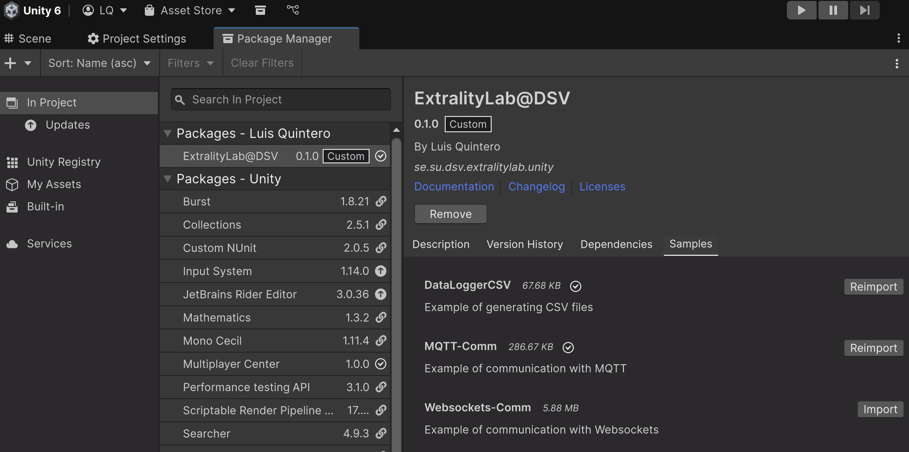

# se.su.dsv.extralitylab.unity

This package contains example code to quick start your projects at the [ExtralityLab](https://extralitylab.dsv.su.se).

Tested on Unity 6000.0.51f1

## Unity

You can add this package to any existing Unity project: 

1. Go to Package Manager
2. Click on the **+** sign
3. If you have Git installed. Click on *Add package from git URL* and point to: `https://gitea.dsv.su.se/ExtralityLab/se.su.dsv.extralitylab.unity.git`
4. If you do **NOT** have git installed. Download the ZIP file from [this Gitea Repo](https://gitea.dsv.su.se/ExtralityLab/se.su.dsv.extralitylab.unity). Click on *Add package from disk* and point at the `package.json` inside the path where you unzipped this folder.
5. Once installed, find in the Unity Package Manager the package `ExtralityLab@DSV`. Go to the tabs `Samples` and import the desired code. Each sample has a README file with the respective documentation.

If you need more instructions on how to install packages, click on this documentation to [install through Git](https://docs.unity3d.com/Manual/upm-ui-giturl.html). If you downloaded the ZIP file, follow these [instructions to install manually](https://docs.unity3d.com/Manual/upm-ui-local.html).

## Samples

Download the corresponding Sample and read the documentation in its README.md file.

- [README from sample DataLoggerCSV](Samples~/DataLoggerCSV/README.md)
- [README from sample MQTT](Samples~/MqttComm/README.md)
- [README from sample Websocket](Samples~/WebsocketsComm/README.md)

## Contact

Luis Quintero | luis.quintero@dsv.su.se | https://luisqtr.com