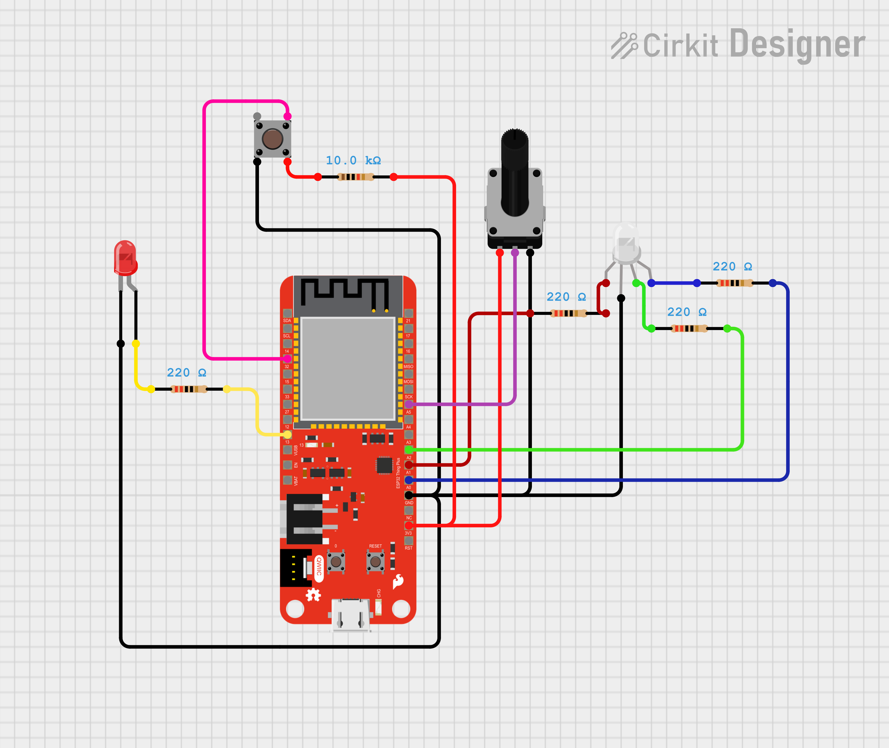
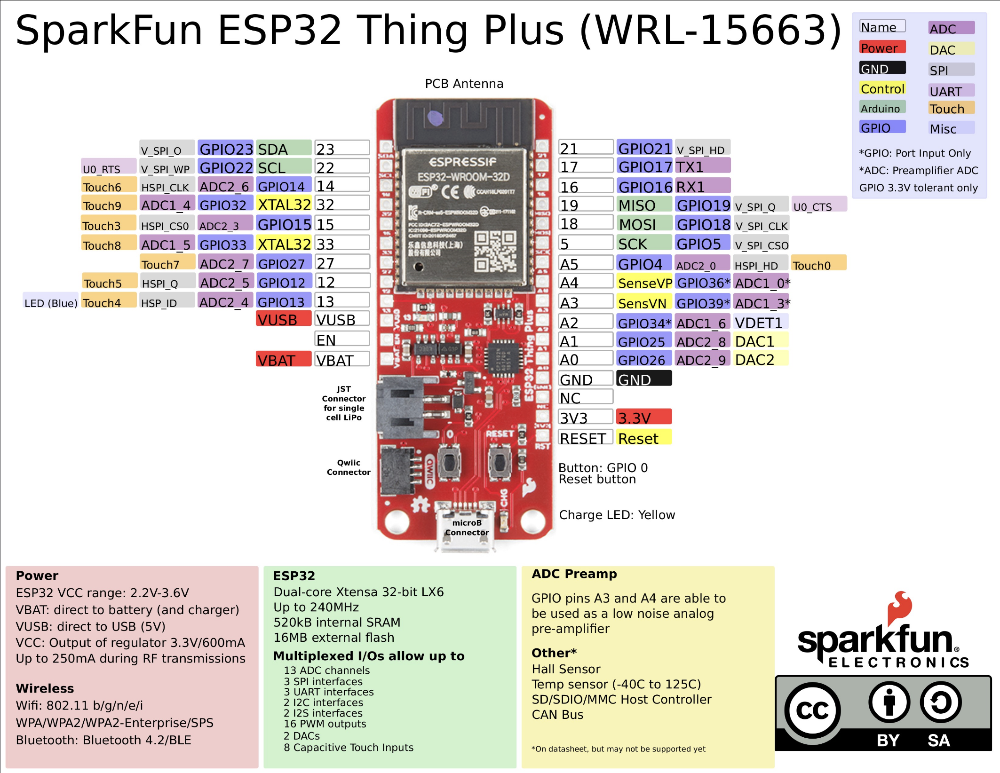
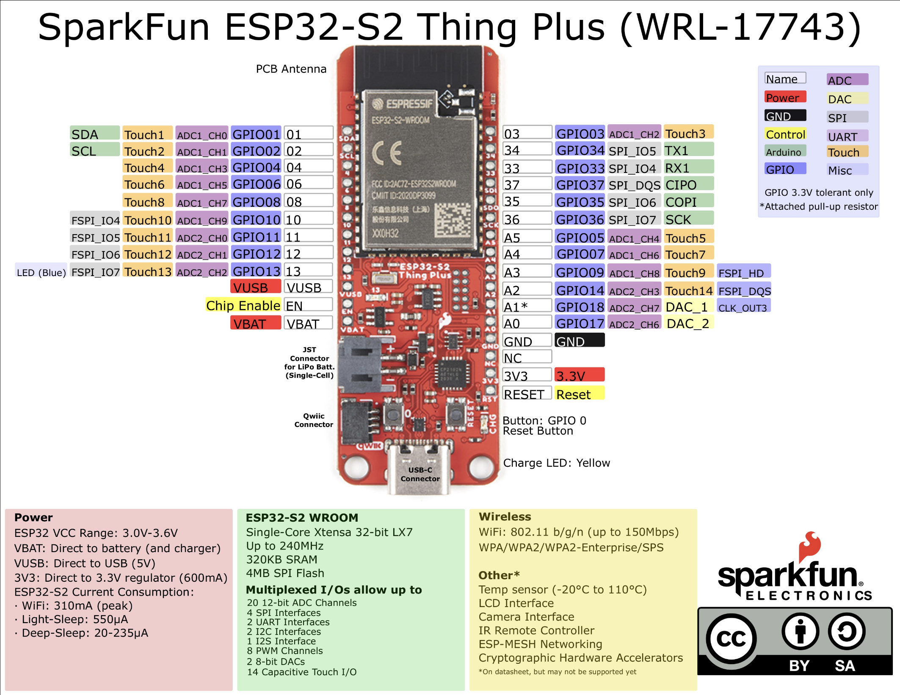
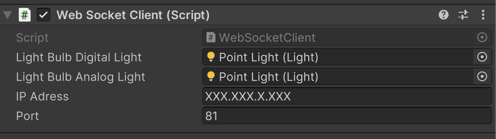
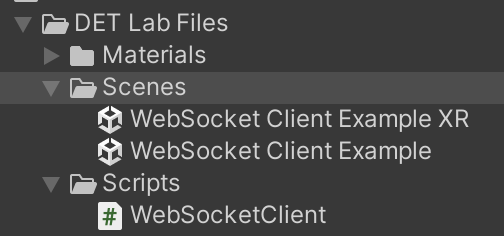

# ExtralityLab - Websockets

This repository was created as an initial template for students to use when developing basic applications with IoT devices, such as the ESP32, Meta Quest HMDs, and the Unity Game Engine. Its contents serve as a tutorial for future tasks in the Design for Emerging Technologies (DET) course at Stockholm University.

 ## Dependencies
 
  This project makes use of the following hardware:
   - Esp32 Dev Board (we will be using either an [Esp32 WROOM](https://www.sparkfun.com/products/15663) or [Esp32-S2 WROOM](https://www.sparkfun.com/products/17743) from SparkFun Electronics)
   - Any [Meta Quest](https://www.meta.com/se/en/quest/) series headset (with the exception of Quest 1). There is also an example that does not require a headset

This project makes use of the following software:
 - [Unity](https://unity.com/download) v2022.3.53f1 or above
 - [Arduino IDE](https://www.arduino.cc/en/software) v2.3.4 or above

This project makes use of the following plugins or libraries:
- [Meta XR Core SDK](https://assetstore.unity.com/packages/tools/integration/meta-xr-core-sdk-269169) v72 (Unity)
- [Meta XR Interaction SDK](https://assetstore.unity.com/packages/p/meta-xr-interaction-sdk-265014) v72 (Unity)
- [NativeWebSockets](https://github.com/endel/NativeWebSocket) v1.1.5 (Unity)
- [ESP32 Package](https://github.com/espressif/arduino-esp32) v3.1.1 (ArduinoIDE)
- ["WebSockets Library"](https://www.arduinolibraries.info/libraries/web-sockets) v2.6.1(ArduinoIDE)
- ["WifiWebServer Library"](https://docs.arduino.cc/libraries/wifiwebserver/) v1.10.1 (ArduinoIDE)

 ## Useful Links
 - [Guide to install ESP32 on ArduinoIDE](https://docs.espressif.com/projects/arduino-esp32/en/latest/installing.html)
 - [Download Unity](https://unity.com/download)

# ESP32 Instructions

### Before you start...

 - Make sure you have the [ArduinoIDE](https://www.arduino.cc/en/software) installed
 - You might need to install the CP2104 USB Driver, you can find them in this link
   - [Windows drivers](https://cdn.sparkfun.com/assets/learn_tutorials/8/5/2/CP210x_Universal_Windows_Driver.zip)
   - [Mac drivers](https://www.silabs.com/documents/public/software/Mac_OSX_VCP_Driver.zip)
    - ***Note: You might need to reboot your device after installing the drivers***
- If you face any other problems, be sure to follow the "Software Setup" section on [this guide](https://learn.sparkfun.com/tutorials/esp32-thing-plus-hookup-guide/all#software-setup)

### Once you have ArduinoIDE installed and open...

1. Install the ESP32 package by going to "Tools -> Board:"**SomeBoardName**" -> Boards Manager" and then searching for "Esp32".
      - Install the "Esp32 by Espresif" option .
2. Install the following Libraries by going to "Tools -> Manage Libraries"
   - ["WebSockets"](https://www.arduinolibraries.info/libraries/web-sockets) by Markus Sattler
   - ["WifiWebServer"](https://docs.arduino.cc/libraries/wifiwebserver/) by Khoi Hoang
   - Any other library dependencies required by the above mentioned ones if prompted to do so
3. Check if the network settings and IP address and correct. 
   - On the "ESP32_Server.ino" file, change the "ssid" and "password" variables to match your desired network credentials
4. Plug in your ESP 32 board, select the correct port and upload the code by clicking on the "Upload" button or by going to "Sketch -> Upload"
    - ***Note: if your computer does not recognize the board model automatically, you might need to specify it manually***
    - If your IDE is stuck on "Connecting to board", click on the physical "Boot/Flash" button on the ESP32 board (the one labeled with a "0")
5. Click the "Serial Monitor" button (it's on the right corner of the Arduino IDE), or go to "Tools -> Serial Monitor". Once you have that window open, click on the far right dropdown list and change it to "115200 baud"
   - Note: Don't worry if you see a lot of weird symbols such as ���, this just means that the Serial monitor is trying to display the messages from the board using the wrong Baud value
6. Click on the physical "Reset" button on the ESP32 (it is labelled with "Reset") and if your Serial Monitor window shows something along the lines of "Printing this device's details bellow...", and "Attempting to connect to **(network name)** network...", you have successfully uploaded the file to the board

### Circuit hookup guide:

In order to complete this lab, you will need the following items:

- 1x ESP32 board variant
- 1x Breadboard
- 1x Potentiometer
- 1x Button Switch
- 1x LED (any color)
- 1x RGB LED (or 3 extra LEDS with different colors)
- 1x 10k (10000) Ohm (Ω) resistor
- 4x 220 Ohm (Ω) resistor

The following sketch is an example of how you should connect each component to the ESP32 board: 

- ***Note 1: The above shown schematic is just an example and might not reflect the same pins used in the given code. Make sure you follow the appropiate schematics and change the code accordingly to fit your chosen pins!***
- ***Note 2: Make sure you connect the RGB LED and potentiometer to supported Analog Input Pins! The Button Switch and the single color LED can be connected to regular GPIO pins. Use the guides in the next images to understand where these are***

#### ESP32 Board Schematic guides provided by SU:

SparkFun Esp32 Hookup guide. For more infomation see [this link](https://learn.sparkfun.com/tutorials/esp32-thing-plus-hookup-guide/all)

SparkFun Esp32-S2 Hookup guide. For more infomation see [this link](https://learn.sparkfun.com/tutorials/esp32-s2-thing-plus-hookup-guide/all)

# Unity Instructions

### Before you start...

 - Make sure you have the [Unity Game Engine](https://www.arduino.cc/en/software) version 2022.3.53f1 or above
 - Make sure you have installed the Android modules (Tip: On Unity Hub go to "Installs", select the Gear icon on the correct install and then "Add Modules". If "Android Build Support" does not say "Installed" under the "Download Size" column, tick the box on the left and click the "Install" button)
 - On the "Projects" tab, click the "Add" button on the top right corner, and then "Add project from disk". Choose the "SU_ESP32-Unity_Communication" folder inside this repository. The project should now be added to your 

### Once Unity is installed and the project opened...

- If you get prompted to restart the Unity Editor select "Ignore"
- If you get prompted to choose the OVR hand, select either "Remind me later" or "Keep using OVR Hand"
- Go to "File"-> "Build Settings". Once a new window opens, locate and click on "Android" under "Platform" on the left side of the window. Once that is done click on "Switch Platform". Once that is done you can close the "Build Settings" window.
  - ***Note: If the "Android" option is greyed out, it means you don't have the required modules installed. Refer back to the "Before you start" section to solve this***
- Once you have done finished these steps, open either the "WebSocket Client Example" or "WebSocket Client Example XR" scenes.

### Setting up the project

- Once you have one of the scenes open, locate the "WebSocketClient Manager" GameObject. It should have a "Web Socket Client" script attached to it.
- Replace the "IP Address" and "Port" with the right values from the ESP32
  - ***Note: You can get the "IP Address" using the Serial Monitor in the Arduino IDE and the "Port" from the "ESP32_Server.ino" file***

- Assuming your ESP32 is correctly setup, you can now either hit the "Play" button in Unity (if you are using the "WebSocket Client Example" scene) or build a new apk and deploy it to your device (if you are using the "WebSocket Client Example XR")

### Highlights of the project

The "DET Lab Files" folder contains all the required files for this demo.

There is only 1 script that truly matters and that is the "WebSocketClient.cs" script inside the "Scripts" folder. This is responsible for the communication between the device running Unity and the ESP32. Examine it to better understand how it works.

There are 2 Unity Scenes created for this project.

- "WebSocket Client Example" can be ran without a VR headset and does the exact same thing as the other Scene
- "WebSocket Client Example XR" can only be run with a Meta Quest device (or with a simulator).

 ---
 Made by: António Pinheiro Braga - antonio.braga@dsv.su.se
 Code based on example provided by: [Anas Kuzechie](https://akuzechie.blogspot.com/2020/12/esp32-websocket-server.html)
